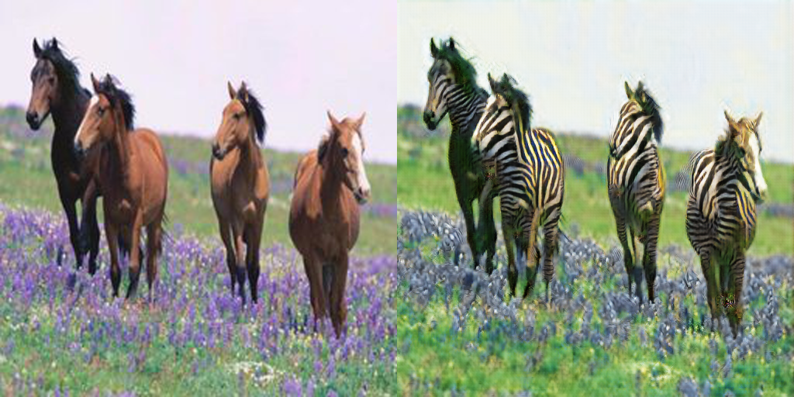
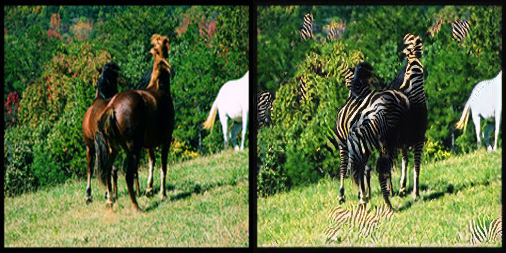
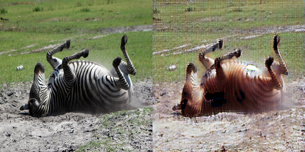
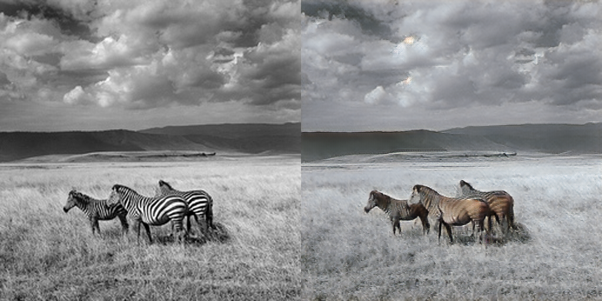

# **CycleGAN**

* 논문

    [Unpaired Image-to-Image Translation using Cycle-Consistent Adversarial Networks](https://arxiv.org/pdf/1703.10593.pdf)

* horse(A) to zebra(B) - < 200 epoch 학습시킨 결과 >
    
    *  A to B

         
         
        
    *  B to A

         
         

